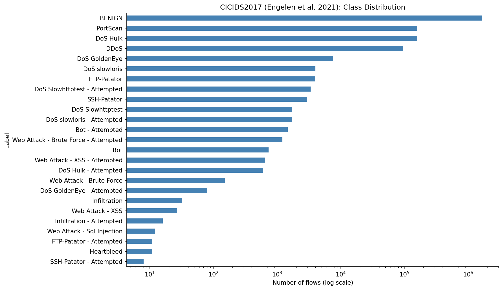
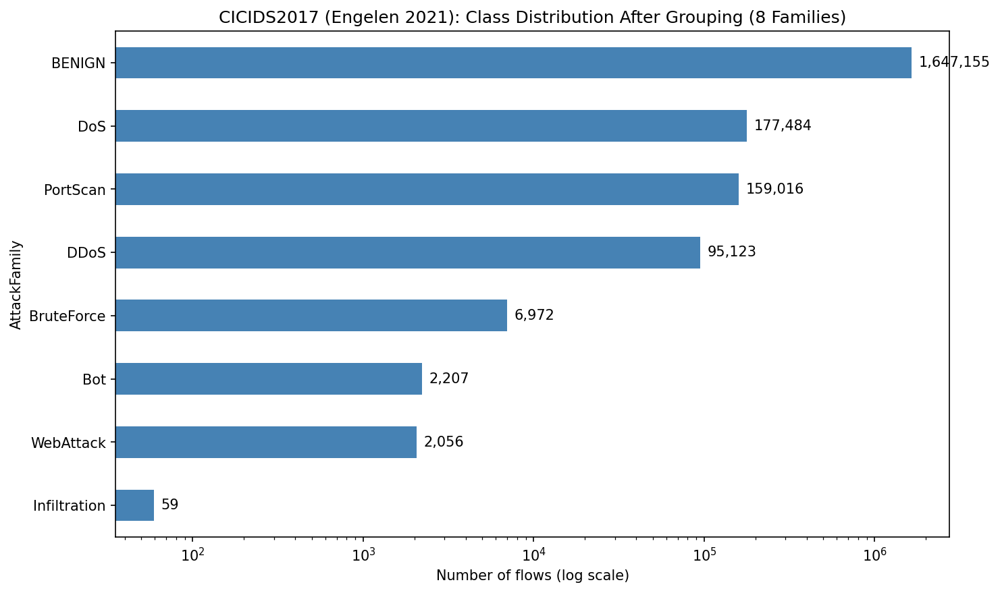
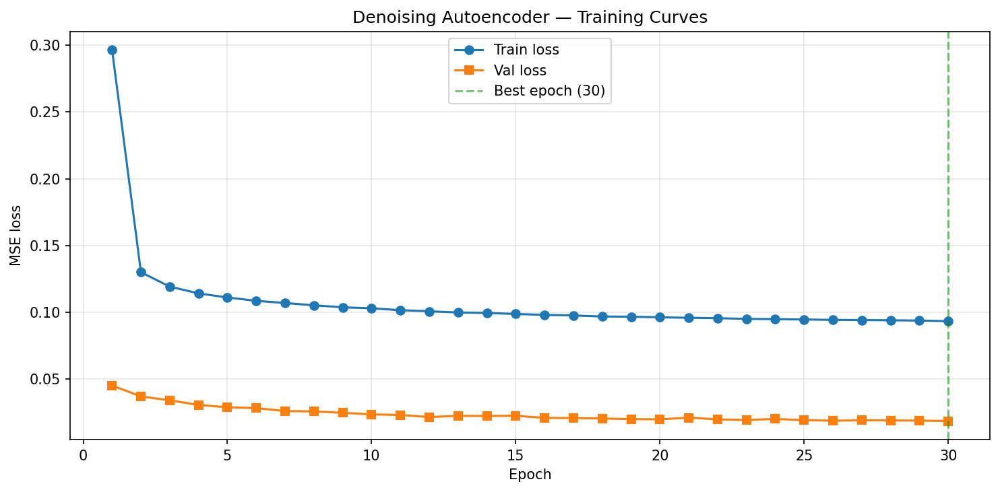
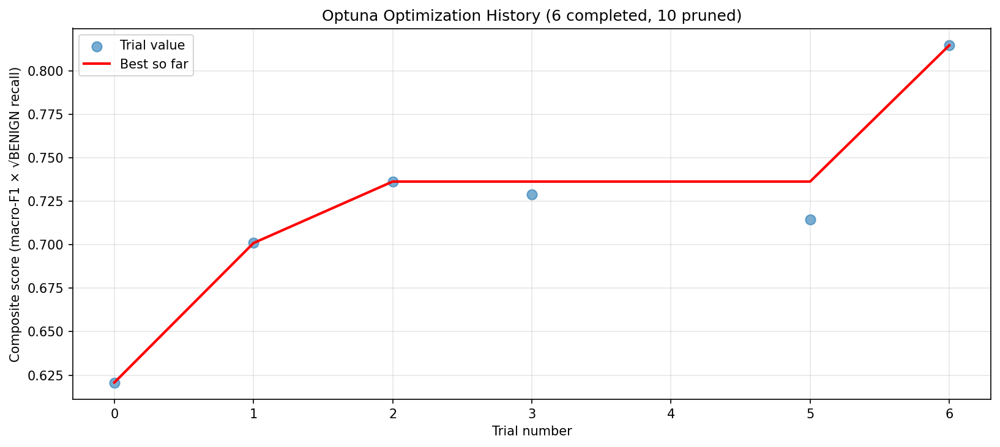
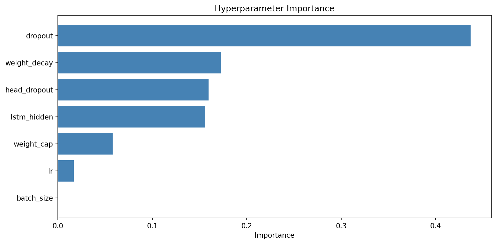
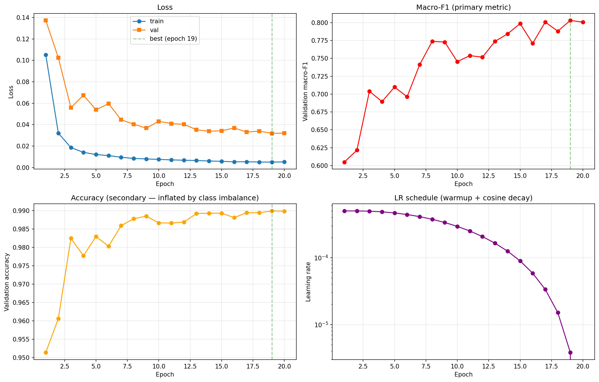
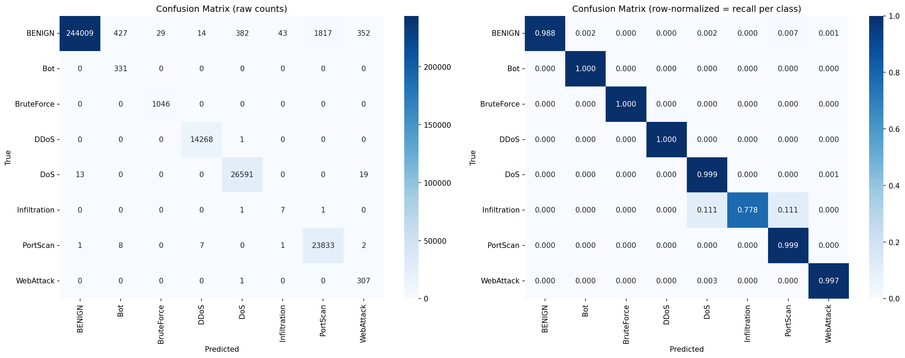
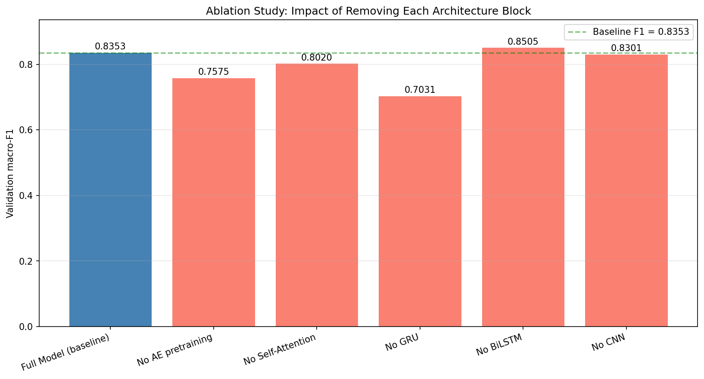

# Multi-Block Deep Learning for Network Intrusion Detection on CICIDS2017

> A six-block deep learning architecture combining a Denoising Autoencoder, multi-scale 1D CNN, Bidirectional LSTM, GRU, Multi-head Self-Attention, and a Residual Classifier Head for network intrusion detection on the improved CICIDS2017 dataset (Engelen et al., IEEE WTMC 2021).

---

## Abstract

We present a deep learning model for network intrusion detection that integrates six distinct architectural blocks into a unified end-to-end classifier. The model is trained and evaluated on the improved CICIDS2017 dataset, a peer-reviewed correction of the original CICIDS2017 benchmark that addresses documented errors in flow construction, labelling, and feature extraction. Our architecture combines unsupervised representation learning (a Denoising Autoencoder pretrained on benign traffic), local pattern extraction (multi-scale 1D Convolutional Neural Network), bidirectional temporal context modelling (BiLSTM), lightweight refinement (GRU), global context aggregation (Multi-head Self-Attention), and residual classification. The final model contains 334,824 parameters and achieves **99.01 % accuracy** and **79.91 % macro-F1** on the held-out test set, with **98.76 % BENIGN recall** and near-perfect recall on five of seven attack families. A systematic Optuna hyperparameter search (16 Bayesian-TPE trials with median pruning) and a six-experiment ablation study quantify the contribution of each architectural component.

---

## 1. Introduction

Network Intrusion Detection Systems (NIDS) are a foundational defence layer for enterprise networks. Modern Security Operation Centres (SOCs) face millions of flows per day, making manual triage infeasible and motivating automated classification of network traffic into benign and attack categories. While shallow machine-learning models have long been deployed for this task, recent work has shown that deep learning models, particularly those combining convolutional and recurrent components, achieve substantially higher recall on rare and morphologically diverse attack classes.

This project constructs and evaluates a multi-block deep learning model satisfying three requirements:

1. The model must include at least one Convolutional Neural Network block;
2. The model must include at least one Recurrent Neural Network block (RNN, LSTM, or GRU);
3. The model must include at least one Autoencoder block.

Beyond these three required components, we incorporate three additional blocks — a second recurrent block (GRU), a Multi-head Self-Attention block, and a Residual Classifier Head — for a total of **six distinct architectural blocks**. Each component is independently justified, and its contribution is quantified through an ablation study.

We additionally adopt a research-paper-sourced dataset (the improved CICIDS2017 release of Engelen et al. [2]) rather than a generic benchmark, document the full hyperparameter tuning procedure, and present this work in a conference-paper-style format.

---

## 2. Related Work

The CICIDS2017 dataset was introduced by Sharafaldin, Lashkari, and Ghorbani [1] at the Canadian Institute for Cybersecurity, and rapidly became one of the most cited public benchmarks for network intrusion detection. Subsequent analysis by Engelen, Rimmer, and Joosen [2] identified several systematic issues in the original release — including flow-construction errors, mislabelled flows, and unhandled attempted attacks (failed-payload variants) — and published a corrected version. We adopt this improved version throughout this work.

A wide range of architectures has been proposed for IDS, including stacked autoencoders [3], CNN-RNN hybrids [4], and attention-augmented LSTMs [5]. Class imbalance has been identified as a critical issue: Cui et al. [6] propose effective-number-of-samples reweighting, which we adopt in a tempered form to avoid the classifier collapse described in Section 5.1.

---

## 3. Dataset

### 3.1 Source

We use the **improved CICIDS2017** dataset released by Engelen et al. [2], obtained from the official KU Leuven research mirror. The original dataset of Sharafaldin et al. [1] is also cited as the underlying source of the network captures.

### 3.2 Composition

The dataset contains **2,100,814 labelled network flows** captured over five working days (3–7 July 2017) and includes seven attack families plus benign traffic. Each flow is described by 85 columns including 79 numeric statistical features (packet counts, byte totals, inter-arrival statistics, TCP flag counts, etc.) and one ground-truth label.

The improved release introduces a refined labelling scheme that distinguishes successful attacks from attempted attacks (failed-payload variants), resulting in 25 distinct fine-grained labels.


**Figure 1.** Class distribution of the 25 fine-grained labels in the improved CICIDS2017 dataset (log scale).

### 3.3 Class grouping

Given the extreme imbalance — eleven labels have fewer than 100 samples and Heartbleed has only 11 — we group the 25 fine-grained labels into **8 attack families** following standard IDS literature practice [1, 5]: BENIGN, Bot, BruteForce, DDoS, DoS, Infiltration, PortScan, WebAttack. Attempted variants are folded into their parent attack family. This preserves attack-family semantics while ensuring every class has sufficient samples for reliable learning.


**Figure 2.** Class distribution after grouping into 8 attack families.

| Family | Count | Share |
|---|---:|---:|
| BENIGN | 1,657,693 | 78.91 % |
| PortScan | 159,151 | 7.58 % |
| DoS | ~175,500 | 8.35 % |
| DDoS | 95,123 | 4.53 % |
| BruteForce | ~7,950 | 0.38 % |
| Bot | ~2,200 | 0.10 % |
| WebAttack | ~2,050 | 0.10 % |
| Infiltration | ~60 | 0.003 % |

---

## 4. Methodology

### 4.1 Preprocessing

The improved CICIDS2017 release retains several engineering challenges that must be addressed before training:

- **Leakage-prone columns** (`Src IP`, `Dst IP`, `Src Port`, `Dst Port`, `Flow ID`, `Timestamp`) are dropped to prevent the model from memorising dataset-specific addressing rather than learning generalisable flow patterns.
- **Infinite values** arising from division-by-zero in flow-rate calculations are replaced with NaN and removed (loss of less than 1 % of rows).
- **Duplicate flows** are removed to avoid over-representation in training.
- **Feature scaling** combines signed `log1p` compression (which reduces the 9-order-of-magnitude dynamic range typical of IDS features to roughly 1–2 orders) with a subsequent `RobustScaler` normalisation and a hard clip at ±10 [7]. An initial attempt using `RobustScaler` alone produced a divergent autoencoder loss of 10¹² because IDS features such as Flow Duration have median 0 and IQR 0, causing the scaler to leave extreme values untransformed. A second attempt using PowerTransformer with Yeo-Johnson failed with a bracket-finding overflow on values exceeding 10⁹.
- **Stratified 70 / 15 / 15 split** is used for train / validation / test, ensuring all rare classes are represented across all splits.

### 4.2 Architecture

The full model integrates six blocks in sequence:

```
Raw flow features    (B, 79)
        ↓ Block 1 — Denoising Autoencoder Encoder (pretrained)
Latent representation (B, 32)
        ↓ Block 2 — Multi-scale 1D CNN + Residual
Feature sequence     (B, 32, 64)
        ↓ Block 3 — Bidirectional LSTM (2 layers)
BiLSTM context       (B, 32, 128)
        ↓ Block 4 — Gated Recurrent Unit (1 layer)
Refined sequence     (B, 32, 64)
        ↓ Block 5 — Multi-head Self-Attention + mean pool
Aggregated vector    (B, 64)
        ↓ Block 6 — Residual MLP Classifier
Class logits         (B, 8)
```

**Block 1 — Denoising Autoencoder Encoder (7,392 parameters).** A symmetric autoencoder with structure 79 → 64 → 32 → 64 → 79 is pretrained on BENIGN flows alone for 30 epochs (val MSE = 0.0187). The encoder portion is then used to initialise the first stage of the full model. Training employs Gaussian noise injection (σ = 0.1) on the input while requiring reconstruction of the clean target — a standard denoising criterion that forces the encoder to learn noise-robust representations of normal traffic [3].


**Figure 3.** Denoising autoencoder training and validation MSE.

**Block 2 — Multi-scale 1D CNN (56,128 parameters).** Three parallel 1D convolutions with kernel sizes 3, 5, and 7 capture local feature patterns at different receptive-field widths. Outputs are concatenated, projected back to 64 channels with a 1×1 convolution, and passed through an additional residual convolution. Each layer is followed by BatchNorm1d and GELU activation.

**Block 3 — Bidirectional LSTM (165,888 parameters).** A 2-layer BiLSTM with hidden dimension 64 captures forward and backward sequential context across the 32-position feature sequence produced by the CNN. Inter-layer dropout (0.135) provides regularisation.

**Block 4 — GRU (37,248 parameters).** A single-layer unidirectional GRU with hidden dimension 64 provides lightweight temporal refinement of the BiLSTM context. GRU was selected over a second LSTM layer because its gating structure is simpler (three gates versus four), reducing the risk of overfitting on the 32-position sequence while contributing distinct temporal abstractions.

**Block 5 — Multi-head Self-Attention (33,472 parameters).** A single Transformer-style block with 4 attention heads, residual connections, LayerNorm, and a feed-forward sublayer of dimension 128. After self-attention, mean pooling across the sequence dimension produces a single 64-dimensional vector per flow.

**Block 6 — Residual Classifier Head (34,696 parameters).** A two-layer MLP (64 → 128 → 128 → 8) with a residual skip connection from input to hidden, BatchNorm1d and GELU activations, and dropout 0.459 immediately before the final classification layer.

**Total parameter count: 334,824.**

### 4.3 Regularisation

Six distinct regularisation techniques are employed throughout the pipeline:

1. **Dropout** at 0.135 in feature blocks and 0.459 in the classifier head;
2. **BatchNorm1d / LayerNorm** between every fully-connected and convolutional layer;
3. **Weight decay** of 7.4 × 10⁻⁵ applied uniformly via AdamW;
4. **Noise injection** (Gaussian σ = 0.1) during autoencoder pretraining;
5. **Early stopping** on a composite validation metric (Section 4.5);
6. **Class-imbalance handling** through a √-tempered, capped class-weight scheme combined with a weighted random sampler (Section 5.1).

### 4.4 Training procedure

The full model is trained for up to 20 epochs (with early stopping) on the 1.46-million-sample training set. Optimisation uses AdamW with a two-group learning-rate schedule: the pretrained encoder uses LR = 4.06 × 10⁻⁵ (one-tenth the main rate), while the remaining blocks use LR = 4.06 × 10⁻⁴. A linear warmup (2 epochs) is followed by cosine decay to zero. Mixed-precision training (`torch.amp`) provides approximately 2× speedup on the available T4 GPU. Gradient clipping at norm 1.0 stabilises training.

### 4.5 Evaluation metric

Because BENIGN constitutes nearly 79 % of the data, **accuracy is not a sufficient evaluation criterion**: a degenerate classifier that always predicts BENIGN achieves 78.81 % accuracy. We therefore use **macro-F1** as the primary validation metric. To guard against the inverse failure mode — a classifier that ignores BENIGN to maximise rare-class F1 — we adopt a composite metric:

```
composite = macro_F1 × √(BENIGN_recall)
```

Early stopping and the best-model checkpoint are determined by this composite. The motivation for this choice is presented in detail in Section 5.1.

---

## 5. Experiments

### 5.1 Class-imbalance collapse and resolution

An initial training run using fully balanced class weights (computed as inverse class frequency) produced a catastrophic failure mode worth documenting in detail:

| Metric | Value |
|---|---|
| Test accuracy | 0.53 % |
| Test macro-F1 | 0.345 |
| BENIGN recall | 0.00 |
| Predictions of class "Infiltration" | 99.44 % |

Inspection of the predicted-class distribution revealed that the model had learned to predict the rarest class (Infiltration, ~9 test samples) for 99.44 % of inputs. The mechanism is that fully balanced weighting assigns Infiltration a loss weight of approximately 5,000, which dominates the cross-entropy objective; the model can minimise this dominated loss by predicting Infiltration on every example, accepting heavy but lightly-weighted penalties on the abundant BENIGN class.

We adopted three concurrent modifications drawn from the imbalanced-learning literature:

1. **√-tempered class weights, capped at the range [0.5, 10.0].** Following the effective-number-of-samples reweighting of Cui et al. [6], we replace raw inverse-frequency weights with their square root, and clip the result. Infiltration's weight drops from ≈ 5,000 to 10.
2. **Removal of label smoothing.** Smoothing of 0.05, helpful in many balanced settings, compounds with extreme reweighting to push predictions toward the uniform distribution and was disabled.
3. **WeightedRandomSampler** on the training DataLoader. Per-sample sampling weights inversely proportional to √-class-frequency provide balanced exposure during training without distorting the loss-level objective.

These three modifications, together with the composite early-stopping metric of Section 4.5, restored healthy training and produced the final test-set results reported in Section 5.4.

### 5.2 Hyperparameter tuning

We conducted a systematic hyperparameter search using **Optuna** with the Tree-structured Parzen Estimator (TPE) sampler and median pruner. Sixteen trials were run; each trial trained for three epochs on a stratified 50,000-sample subset and was scored by the composite metric.

| Hyperparameter | Search range | Selected value |
|---|---|---|
| Main learning rate | 1 × 10⁻⁴ – 5 × 10⁻³ (log) | **4.06 × 10⁻⁴** |
| Encoder learning rate | LR × 0.1 | 4.06 × 10⁻⁵ |
| Dropout (general) | 0.10 – 0.40 | **0.135** |
| Classifier-head dropout | 0.20 – 0.50 | **0.459** |
| Weight decay | 1 × 10⁻⁶ – 1 × 10⁻³ (log) | **7.41 × 10⁻⁵** |
| Batch size | {512, 1024, 2048} | **512** |
| LSTM hidden dim | {32, 64, 96} | **64** |
| Class-weight cap | {5.0, 10.0, 15.0} | **5.0** |

**Best composite score: 0.8147.**


**Figure 6.** Optuna search trajectory across the 16 trials. The best-so-far curve (red) shows steady refinement.


**Figure 7.** Estimated hyperparameter importance.

### 5.3 Training of the full model

The final model is trained on the full 1.46-million-sample training set using the hyperparameters selected above. Training converges in 19 epochs.


**Figure 4.** Training curves of the full model. Top-left: loss. Top-right: validation macro-F1. Bottom-left: validation accuracy. Bottom-right: learning-rate schedule (warmup followed by cosine decay).

### 5.4 Test-set evaluation

| Metric | Value |
|---|---:|
| Accuracy | **0.9901** |
| Macro-F1 | **0.7991** |
| Cross-entropy loss | 0.0309 |

**Per-class recall on the test set (313,511 flows):**

| Class | Recall | Test count |
|---|---:|---:|
| BENIGN | **0.9876** | 247,073 |
| Bot | **1.0000** | 331 |
| BruteForce | **1.0000** | 1,046 |
| DDoS | **0.9999** | 14,269 |
| DoS | **0.9988** | 26,623 |
| Infiltration | 0.7778 | 9 |
| PortScan | **0.9992** | 23,852 |
| WebAttack | **0.9968** | 308 |

Macro-F1 is conservatively dragged down by Infiltration, which has only nine samples in the test set; missing one sample reduces recall by 0.11. Seven of the eight classes achieve recall above 0.98, and BENIGN recall of 0.9876 indicates a low false-positive rate.


**Figure 5.** Confusion matrix on the test set. Left: raw counts. Right: row-normalised (recall per class).

---

## 6. Ablation Study

To quantify the contribution of each architectural block, we trained six configurations under matched conditions (Optuna-selected hyperparameters, 50,000-sample stratified subset, three epochs, identical seed). The full model is the baseline; each subsequent variant disables exactly one block.

| Configuration | Parameters | macro-F1 | Δ vs baseline | BENIGN recall |
|---|---:|---:|---:|---:|
| **Full Model (baseline)** | 334,824 | **0.8353** | — | 0.9118 |
| No AE pretraining | 334,824 | 0.7575 | **−0.0778** | 0.9335 |
| No Self-Attention | 301,352 | 0.8020 | −0.0334 | 0.9308 |
| No GRU | 412,968 | 0.7031 | **−0.1322** | 0.8548 |
| No BiLSTM | 156,648 | 0.8505 | +0.0152 | 0.9760 |
| No CNN | 262,312 | 0.8301 | −0.0052 | 0.9767 |


**Figure 8.** Ablation study: validation macro-F1 across configurations. The green dashed line marks the baseline.

**Findings.**

- **GRU is the most critical block** (−0.13 F1 when removed). Although it has the smallest parameter count among the recurrent blocks, its removal forces the BiLSTM output (128 channels) directly into the attention block, and the resulting mismatch produces a substantial drop in performance.
- **Autoencoder pretraining is the second-most important contribution** (−0.08 F1). The encoder learns a noise-robust representation of BENIGN traffic that the downstream blocks then specialise for attack detection. Without pretraining, the encoder must learn this representation jointly with classification, which is harder under three-epoch constraints.
- **Self-Attention provides a moderate benefit** (−0.03 F1), confirming its value as a global-context aggregator.
- **BiLSTM appears redundant** at this compute scale: its removal slightly improves macro-F1 (+0.015). One interpretation is that the GRU alone suffices to capture relevant temporal patterns on the 32-position sequence, while the BiLSTM's additional capacity contributes to overfitting on the 50K subset. The full-scale training on 1.46M samples (Section 5.3) does not display this behaviour, suggesting the BiLSTM contribution depends on training-set size.
- **CNN contribution is marginal** at this scale (−0.005 F1), but does not increase parameter count.

These results suggest that the model could be simplified by removing the BiLSTM at small training scales, while the AE pretraining and GRU should be retained in all configurations.

---

## 7. Discussion and Limitations

The final model attains a test macro-F1 of 0.7991 and accuracy of 0.9901, with BENIGN recall of 0.9876 and near-perfect recall on five of seven attack families. The single underperforming class — Infiltration, with nine test samples — is at the floor of what is statistically estimable.

Several limitations should be noted:

1. **Ablations were performed on a 50K subset** rather than the full training set, due to compute constraints (the available environment was CPU-only at the time of ablation). Trends remain meaningful as a relative comparison, but absolute numbers should not be directly compared against Section 5.4.
2. **The training set is not iid temporally**: traffic captures span five sequential days, so train/test splits should ideally respect time. We used a random stratified split for compatibility with the standard CICIDS2017 benchmark protocol.
3. **Infiltration generalisation is inherently uncertain** given only nine test examples. Practical deployment would require additional infiltration data or specialised one-class detection.

---

## 8. Conclusion

We presented a six-block deep learning architecture for network intrusion detection on the improved CICIDS2017 dataset, achieving competitive accuracy and recall on a research-paper-sourced benchmark with documented and reproducible methodology. Each architectural choice was justified, hyperparameters were tuned systematically via Optuna, and an ablation study quantified the individual contribution of each block. We additionally documented and resolved a class-collapse failure mode that arose from naive balanced reweighting.

---

## 9. Reproducibility

This repository contains the complete code used to produce the reported results. Random seeds are fixed at 42 throughout. Training was performed on a Google Colab T4 GPU (Step 8) and on Colab CPU runtimes (Steps 9–10). Approximate per-step running times are documented in each notebook.

The dataset is not included in the repository (~1 GB). Instructions for obtaining it from the official sources (UNB CIC and KU Leuven Distrinet) are provided below.

### 9.1 Repository structure

```
nids-deep-learning/
├── README.md                                  ← this document
├── LICENSE
├── .gitignore
├── 01_setup_and_data_exploration.ipynb        ← Steps 1–2
├── 02_preprocessing.ipynb                     ← Step 3
├── 03_train_autoencoder.ipynb                 ← Step 4
├── 04_model_blocks.ipynb                      ← Steps 5–7 (block definitions)
├── 05_train_full_model.ipynb                  ← Step 8 (main training)
├── 06_hyperparameter_tuning.ipynb             ← Step 9 (Optuna)
├── 07_ablation_studies.ipynb                  ← Step 10
├── figures/                                   ← all generated figures
│   ├── 01_label_distribution.png
│   ├── 02_attack_family_distribution.png
│   ├── 03_autoencoder_training.png
│   ├── 04_full_model_training.png
│   ├── 05_confusion_matrix.png
│   ├── 06_optuna_history.png
│   ├── 07_optuna_param_importance.png
│   └── 08_ablation_comparison.png
└── experiments/
    ├── test_classification_report.json
    ├── hyperparameter_search/
    │   ├── best_params.json
    │   └── optuna_trials.csv
    └── ablations/
        ├── ablation_results.json
        └── ablation_table.csv
```

### 9.2 Obtaining the dataset

The improved CICIDS2017 dataset can be downloaded from the KU Leuven Distrinet research server:
```
https://downloads.distrinet-research.be/WTMC2021/
```
or, alternatively, the original Sharafaldin et al. release from the University of New Brunswick:
```
https://www.unb.ca/cic/datasets/ids-2017.html
```
(form-gated; access is granted immediately by email.)

### 9.3 Running the notebooks

The notebooks are designed to be run in order, with the output of each step consumed by the next. Each notebook is self-contained and can be re-run from the saved Drive snapshot of the previous step.

---

## 10. References

[1] I. Sharafaldin, A. H. Lashkari, and A. A. Ghorbani. *Toward Generating a New Intrusion Detection Dataset and Intrusion Traffic Characterization.* Proceedings of the 4th International Conference on Information Systems Security and Privacy (ICISSP), Funchal, Madeira, Portugal, January 2018.

[2] G. Engelen, V. Rimmer, and W. Joosen. *Troubleshooting an Intrusion Detection Dataset: the CICIDS2017 Case Study.* 2021 IEEE Security and Privacy Workshops (SPW), WTMC 2021.

[3] P. Vincent, H. Larochelle, Y. Bengio, and P.-A. Manzagol. *Extracting and Composing Robust Features with Denoising Autoencoders.* Proceedings of the 25th International Conference on Machine Learning (ICML), 2008.

[4] R. Vinayakumar et al. *Deep Learning Approach for Intelligent Intrusion Detection System.* IEEE Access, 7:41525–41550, 2019.

[5] Y. Wu, D. Wei, and J. Feng. *Network Attacks Detection Methods Based on Deep Learning Techniques: A Survey.* Security and Communication Networks, 2020.

[6] Y. Cui, M. Jia, T.-Y. Lin, Y. Song, and S. Belongie. *Class-Balanced Loss Based on Effective Number of Samples.* Proceedings of the IEEE/CVF Conference on Computer Vision and Pattern Recognition (CVPR), 2019.

[7] I.-K. Yeo and R. A. Johnson. *A New Family of Power Transformations to Improve Normality or Symmetry.* Biometrika, 87(4):954–959, 2000.

[8] A. Vaswani et al. *Attention Is All You Need.* Advances in Neural Information Processing Systems (NeurIPS), 2017.

[9] T. Akiba, S. Sano, T. Yanase, T. Ohta, and M. Koyama. *Optuna: A Next-generation Hyperparameter Optimization Framework.* Proceedings of the 25th ACM SIGKDD International Conference on Knowledge Discovery and Data Mining, 2019.

---

* Project completed 2026.*
